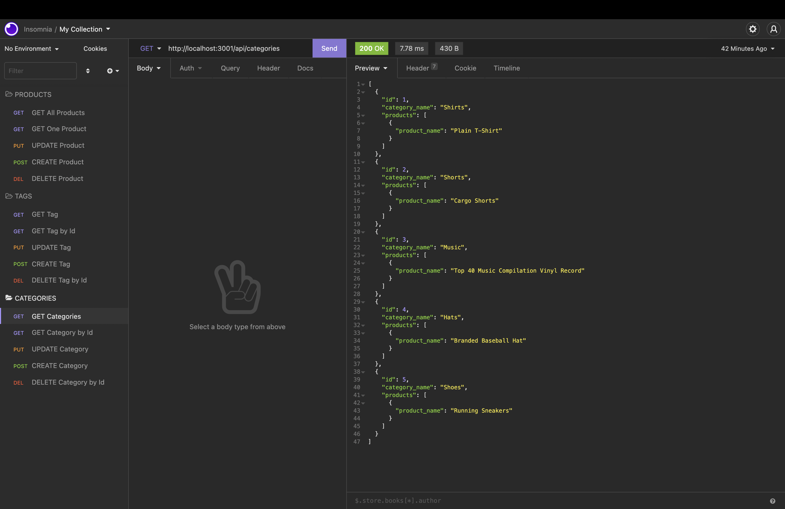

# ORM E-commerce Back End


## Description

This project consisted on creating the back end for an e-commerce site. This application will use a working Express.js API and Sequelize to interact with a MySQL database. It includes a walkthrough video that demonstrates its functionality. 

## Table of Contents

* [Installation](#installation)
* [Snippets](#snippets)
* [Technologies](#technologies)
* [Preview](#preview)
* [Links](#links)

## Installation 

1. Clone the repository to your machine 

```bash
git clone https://github.com/analuciarojas/ORM-E-commerce-Back-End.git
```

2. Install corresponding dependencies (MySql 2, Sequelize, express, etc. ) for example: 

```bash
npm install express
```

3. Sign into MySql and create database ecommerce_db, then follow the next steps

```
CREATE DATABASE ecommerce_db;
```

```
USE ecommerce_db;
```

```
SOURCE db/schema.sql;
```

4. Run the following npm commands next

```bash
npm run seed
```

```bash
npm start
```


## Snippets 

* **Category delete**
```            
router.delete('/:id', (req, res) => {
  // delete a category by its `id` value
  Category.destroy({
    where: {
      id: req.params.id,
    },
  })
  .then((categoryData) => {
    if (!categoryData) {
      res.status(404).json({ message: "No category found with this id" });
      return;
    }
    res.json(categoryData);
  })
      .catch((err) => {
      console.log(err);
      res.status(500).json(err);
    });
});
```   
* **Category post**
```            
router.post('/', (req, res) => {
  // create a new category
  Category.create({
    category_name: req.body.category_name,
  })
    .then((categoryData) => res.json(categoryData))
    .catch((err) => {
      console.log(err);
      res.status(500).json(err);
    });
});
```  
* **Category model**
```            

 Category.init(
  {
    // define columns
    id: {
      type: DataTypes.INTEGER,
      allowNull: false,
      primaryKey: true,
      autoIncrement: true,
    },
    category_name: {
      type: DataTypes.STRING,
      allowNull: false,
    },
  },
  {
    sequelize,
    timestamps: false,
    freezeTableName: true,
    underscored: true,
    modelName: 'category',
  }
);
```           

## Technologies

* JavaScript
* Node.js
* Inquirer
* Express.js
* MySql
* MySql2 
* Sequelize

## Preview

This is a an image of the ecommerce back end being tested on insomnia. 



## Links

* [URL of the Youtube walktrough video](https://youtu.be/CjVNK8yCh7w)

* [URL of the GitHub repository](https://github.com/analuciarojas/ORM-E-commerce-Back-End)